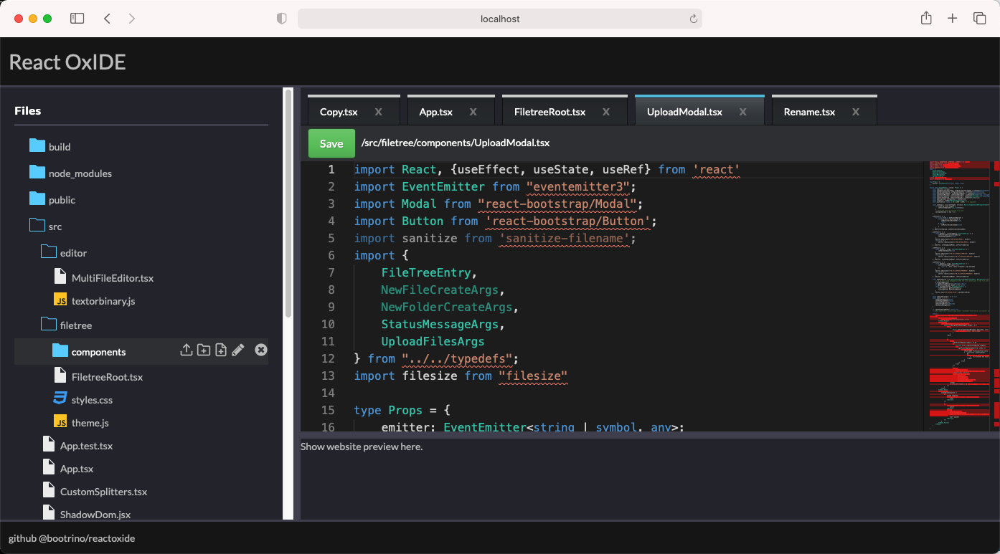
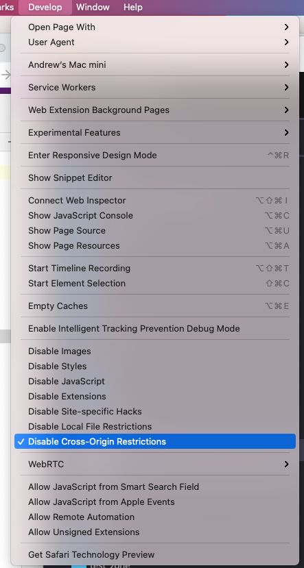

# React OxIDE

React Oxide is a simple code editor that you can add to your ReactJS projects.

### Live demo at: https://www.reactoxide.com/

**Project status**:

Created 28 Sep 2021 by Andrew Stuart andrew.stuart@supercoders.com.au

License: MIT

You are welcome to post questions in the github issues but don't expect an answer - I may or may not be interested in reading/fixing issues.

**Features**:

- Written in TypeScript
- Monaco editor (the core of VSCode) https://microsoft.github.io/monaco-editor/
- Tabs
- File tree 
- File management features: new file/rename/delete/create folder/upload files
- Compatible with WebDAV back ends
- Bootstrap 5

**Event driven React coding style**:

This project uses eventemitter for communication between components. There is no state anywhere apart from component local state.

I don't know if this is a bad idea for some reason but it's done this way because I like the approach and find it makes things more simple and easy to understand.

If you modify this software, please follow the same Event Driven React coding style for consistency.

**What's missing**:

There's no error handling at all right now - if any file operation fails then there's no information given, it just goes splat.

There's no tests - and I'm not writing any - I made this project for me and I don't need tests.

**Credits**:

- Uses this library for integration with the Monaco editor: https://github.com/suren-atoyan/monaco-react
- Initial code (it's pretty much all been rewritten) for the file tree came from: https://codesandbox.io/s/file-tree-live-84jkx
- Bootstrap theme comes from: https://bootswatch.com/slate/
- The screen splitter uses: https://github.com/GeoffCox/react-splitter
- During development I used this Python based webDAV server: https://github.com/rexzhang/asgi-webdav

**WebDAV back end**:

React Oxide talks to a WebDAV back end.

There are plenty of webDAV servers around if you do a Google search you'll find some.

I downloaded this Python based WebDAV server and ran it locally with Python 3.9:

https://github.com/rexzhang/asgi-webdav

The command to start the webDAV server:

python3 -m asgi_webdav --host 0.0.0.0 --port 8000 --root-path .

username is username, password is password

****
**IMPORTANT! WebDAV & CORS!!!!**:

React Oxide needs CORS turned off

If you wanted to deploy React Oxide on the Internet, you would have to solve the CORS problem by putting your webDAV server behind a reverse proxy.  I recommend Caddy but anything such as nginx can do the job.

During development I did not use a proxy server, instead I used MacOS Safari for my development because it has a simple menu option to switch off CORS on the Safari "Develop" menu:

It's a great pity Chrome and Firefox don't have an option to switch off CORS like Safari does.

